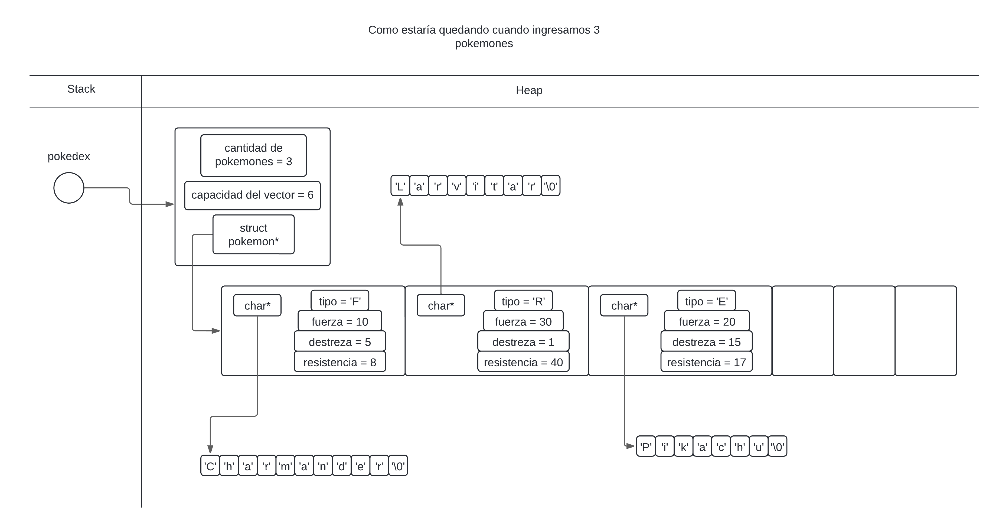

<div align="right">

</div>

# TP1

# MANEJOS DE ARCHIVOS Y ESTRUCTURAS

## Alumno: Juan Ernesto Juarez Lezama - 110418 - jjuarez@fi.uba.ar

- Para compilar:

```bash
gcc -g tp1.c src/csv.c src/pokedex.c src/split.c -o tp1
```

- Para ejecutar:

```bash
./tp1 ejemplos/pokedex.csv
```

- Para ejecutar con valgrind:
```bash
valgrind ./tp1 ejemplos/pokedex.csv
```

---

##  Flujo del programa

Para la implementación de este TP nos piden leer un archivo como argumento de un programa compilado.
Tendrémos 2 estructuras, para la lectura de archivo y para almacenar elemento, en este caso, pokemones.

Acá muestro un diagrama de como sería el flujo del TP para que haga lo que nos piden.

<div align="center">

</div>


## Consideraciones

c = cantidad de caracteres.  
m = cantidad de columnas.  
n = cantidad de pokemones.

Teniendo en cuenta que cada vez que hago uso de un `malloc()` significa que pido bloque(s) de memoria en el heap de manera dinamica, lo cual es `O(1)`, por lo que si pido, tengo que liberar usando `free()`.  
inicializar\declarar una variable, if, break, operadores matematico son `O(1)`. Las funciones `strcpy` y `strcmp` son `O(c)`, ya que se está comparando caracter por caracter.


### Estructura para la lectura de archivo

# csv.c

## `abrir_archivo_csv` O(1)

Inicializa la estructura `struct archivo_csv` y devuelvo su dirección de memoria. Esta estructura inicializada, está ubicada en el heap, en un bloque de memoria de manera dinamica debido al uso de `malloc()`.  
Esta estructura guarda un puntero al tipo de dato FILE*, donde se encuentra nuestro archivo. En qué parte de la memoria se situa el archivo, eso depende del sistema operativo, pero, diremos que en el heap.  
Al ser inicializaciones de `malloc()`, inicializar variables, podemos decir que esta funcion es `O(1)`.

```c
	struct archivo_csv *archivo_tp1 = abrir_archivo_csv(argv[1], ';');
```
<div align="center">

</div>

---

## `leer_linea_csv` O(c²)

En primer lugar, dentro de la función, como no sabemos cuantos caracteres van a ser, y no queremos tener un limite de caracteres, vamos a crear una variable `char* texto` de forma dinamica, donde almacenaremos la cadena de caracteres de una linea del archivo (dentro de la función). Esta parte de la función se ejecuta `c` veces. De esta manera tenermos la linea de texto en una varible. En el peor de los casos, vamos a tener que redimencionar ese vector `k` veces, el costo de usar `realloc()` es `O(c)`, porque estamos pasando los caracteres del anterior bloque, esto hace que el ciclo quede: `n * (O(k * c))`, pero como sabemos que `k` va a ser más chico que `c` a medida que se vayan agregando más caracteres, nos queda `c * (O(c))` => `O(c²)` (1).

```c
	while (codigo != EOF && codigo != '\n') { // c veces
		if (esta_llegando_al_tope_del_vector_texto(tamaño_del_texto,
							   capacidad_linea) &&
		    !redimencionar_vector_texto(
			    &texto,
			    &capacidad_linea)) { // k veces O(c), pero k se desprecia a medida que c crece.
			free(texto);
			return columna_posicion;
		}
```

En la funcion de `dividir_partes`, va a iterar toda la cadena de caracteres en busca de separadores que, como el nombre de la función indica, dividirá en partes, o sea, sabremos la cantidad de columnas, lo cual es `O(c)`. Luego iteraremos nuevamente la cadena de caracteres, y donde veamos un separador, podremos el bloque de caracteres anterior al caracter separador almacenado dinamicamente en el heap, porque la estructura tiene un `char** string`, lo que es un vector de punteros a `char*`, osea, cada posicion del vector, va a apuntar a una direcion de memoria donde inicia cada parte del string. Hay 2 casos en esta funcion, cuando itera todo y no encuentra separador y cuando itera y encuentra muchos separadores, lo que es hacer `c` veces algo que es `O(c)`, lo que significa que esta función nos queda `dividir_string` es `O(c²)`.

```c
	struct Partes *partes = dividir_string(texto, archivo->separador);
```
<div align="center">

</div>

De ahí entramos en un ciclo while, la cual va a estar usando puntero a funciones y punteros a void, esta parte de la función. Al ser un ciclo que dependa de la cantidad de columnas, decimos que el ciclo while es `O(m)`, pero adentro de la funcion, tenemos lo que son las funciones de parseo, en el peor de los casos es que cada columna tenga cadena de caracteres, y al hacer `strcpy` dependerán de la cantidad de caracteres que haya, siendo entonces `O(c)`, entonces nos queda que el ciclo es `m * (O(c))` => `O(m * c)` (3).

```c
	while (columna_posicion < columnas) { // m veces
		if (!funciones[columna_posicion]) {
			liberar_partes(partes);
			return columna_posicion;
		}

		if (!funciones[columna_posicion](
			    partes->string[columna_posicion],
			    ctx[columna_posicion])) { //  o(c)
			liberar_partes(partes);
			return columna_posicion + 1;
		}
		columna_posicion++;
	} // ===> O(m*c)
```

Mencionar que, hacer free(partes), nos cuesta `O(m)` (4), ya que vamos a liberar cada columna que tengamos almacenado en el heap.

```c
	for (int i = 0; i < partes->cantidad; ++i) {
		free(partes->string[i]);
	}
```

Entonces nos quedaria en total que la función queda como `O(c²)`(1) + `O(c²)`(2) + `O(m*c)`(3) + `O(m)`(4) => `O(2c² + m*c + m)`, Ahora bien, tenemos estas 3 variables `2c²`, `m * c` y `c`. la variable de mayor orden es `c²`, porque en el infinito, las variables de menor orden, y las constantes se desprecian. Entonces nos queda que la complejidad computacional es `O(c²)`.

## `cerrar_archivo_csv` O(1)

Cerraremos el archivo que abrimos desde un comienzo, y liberaremos la memoria que pedimos al inicializar nuestra estructura. Tanto cerrar el archivo, como liberar la estructura cuestan `O(1)`.

# pokedex.c

## `pokedex_crear` O(1)

Inicializamos la estructura pokedex donde almacenaremos los pokemones, será un vector dinamico con una capacidad inicial. Al ser una inicializacion de la estructura, es O(1);

```c
	inicializar_pokedex->vector_pokemones =
		malloc(CAPACIDAD_INICAL_POKEDEX * sizeof(struct pokemon));
```

<div align="center">

</div>


## `pokedex_iterar_pokemones` O(n * g(h))

En este caso prefiero mencionar la funcion que itera a los pokemons, porque es lo que usaré en 2 funciones de la pokedex. Esta funcion, al ser una iteracion, va a iterar, en el peor de los casos, a todos los pokemones que seria un costo de `O(n)`.  
Pero hay un problema con la complejidad algoritmica, al ser puntero a funciones, nosotros podemos hacer cualquier cosa con esa función, y de eso dependerá cuanto cuesta esta función: Desde hacer `printf` a cada pokemons que sería `(O(1)` => entonces la función nos queda como `O(n)`, tambien podríá ser iterar el nombre de cada pokemon, que sería `O(c)` => y la función nos queda `O(n * c)`, por eso digo que el coste algoritmico de esta función es `O(n * g(h))` siendo `g(h)` la complejidad computacional de la función que le pasemos.

```c
	for (size_t i = 0; i < pokedex->cantidad_pokemones; i++) { // n veces
		if (!(funcion(
			    &pokedex->vector_pokemones[i],
			    ctx))) { // g(H)
			return i + 1;
		}
	} // =====> O(n * g(h))
```

## `pokedex_agregar_pokemon` O(n * c)

Primero explicar que, cuando agregamos un pokemon, la variable de tipo `struct pokemon`, va a tener un `char* nombre`, pero nosotros no podemos simplemente hacer `vector[posicion] = pokemon`, porque por afuera de la función, así como dimos memoria en el heap para el nombre del pokemon, por afuera también lo vamos a liberar, ya que por afuera, la variable nombre de la estructura pokemon, va a estar actualizandose y tendrá distintas direcciones de memoria, por eso hacemos que adentro de nuestra función, se cree un nuevo bloque de memoria para guardar ahí el nombre del pokemon y no sea liberaro y nos dé problemas con que se perdió dicha memoria, esto es `O(c)`;

```c
	char *nueva_ubicacion_nombre =
		malloc((strlen(pokemon.nombre) + 1) * sizeof(char));
	if (!nueva_ubicacion_nombre) {
		return false;
	}

	strcpy(nueva_ubicacion_nombre, pokemon.nombre);
	pokemon.nombre = nueva_ubicacion_nombre;
```

Ahora, aquí viene la magia de la funcion `pokedex_iterar_pokemones`. Como sabemos, dicha función iterará hasta encontrar un punto de quiebre, para buscar la posición donde debe estar el pokemon, el cual, en forma textual seria: "Si la posicion de este pokemon en el vector, es `mayor` que el nombre del pokemon que quiero agregar, devuelve `false`", o sea, que ahí encontré el pokemon donde debe estar posicionado, hacer esto, cuesta `O(c)`.

```c
	bool buscar_pokemon(struct pokemon *pokemon_actual, // =====> O(c)
				void *nombre_pokemon_a_buscar)
	{
		return !(strcmp(pokemon_actual->nombre,
				(const char *)nombre_pokemon_a_buscar) == 0);
	}
```
Entonces hacemos las distintas comparaciones para saber donde se posiciona el pokemon, hallas la posicion me cuesta `O(n * c)`, porque itero `n` pokemones y companos nombres que es `O(c)`. Aquí algo para aclarar, hay 2 posibles escenarios. Si el nombre del nuevo pokemon es mayor que todos, se posiciona al último, claro está, pero hay 2 problemas: Cuando `pokedex_iterar_pokemones` devuelve la cantidad de pokemones que tenemos, puede ser porque, en ninguna posicion del vector dio `false`, o sea, que puso salir bien del ciclo for, o que el último pokemon dio `false` de ahí porque el uso de este `if`:

```c
	if (no_hay_pokemones(pokemones_iterados) ||
	    (es_el_ultimo_pokemon(pokemones_iterados,
				  pokedex->cantidad_pokemones) &&
	     nombre_pokemon_en_el_vector_es_menor(
		     pokedex->vector_pokemones[pokemones_iterados - 1].nombre,
		     pokemon.nombre))) {
		pokedex->vector_pokemones[pokemones_iterados] = pokemon;
```

La manera de insertar es: encuentro la posicion, y corro todo un espacio a la derecha, siguiendo esta lógica, eso me cuesta `O(n)`, entonces tengo que las operaciones relevantes son `O(n*c + n)`, como `n*c` es dominante ante `n`, nos quedamos con `O(n * c)`

<div align="center">

</div>

## `pokedex_cantidad_pokemones` O(1)

Devuelve la cantidad de pokemones almacenado, al tener ya un contador que se va actualizando cada vez que agregamos un pokemon, no tendriamos que iterar la pokedex y buscar un con tador, eso seríá `O(n)`.

## `pokedex_buscar_pokemon` O(n * c)

Esta es otra función que también usé la función `pokedex_iterar_pokemones`, busca el pokemon y rompe donde: "Si el nombre del pokemon donde estoy parado en el vector, es igual al que estoy buscando, retorna `false`. Al ser una funcion que que itera cada pokemon y compara la cadena de caracteres (nombres), eso cuesta `O(c)`, por lo tanto, la función es `O(n * c)`;

```c
	bool buscar_posicion(struct pokemon *pokemon_actual,
				void *nombre_pokemon) // =====> O(c)
	{
		return !(strcmp(pokemon_actual->nombre, (char *)nombre_pokemon) > 0);
	}
```

Quiero destacar que en esta función, hubiese hecho una busqueda binarioa, siendo así mejor optimizada y quedando `O(log(n))`, ya que voy agarrando mitad de la mitad de la mitad y así hasta encontrar el elemento buscado, pero preferí no hacerlo y demostrar el uso de puntero a funciones y manipulación de `void*`.

## `pokedex_destruir` O(n)

Para destruir la pokedex, debemos liberar la memoria que hemos pedido, por lo que vamos a ir liberando desde lo más profundo, para afuera, así como en `liberar_partes` de `split.c`. Vamos a iterar cada posicion del vector de pokemones, y como mencioné cuando agregué pokemones, yo asigné memoria para el nombre, entonces debo liberar la memoria de cada nombre de todos los pokemones, una vez que hago eso, puedo liberar la memoria del vector que almacena pokemones, y luego la estructura de la pokedex, lo que pesa en esta función es la iteracion de los `n` pokemones, por eso es `O(n)`.

```c
	for (size_t i = 0; i < pokedex->cantidad_pokemones;
			i++) {
		free(pokedex->vector_pokemones[i].nombre);
	}
```