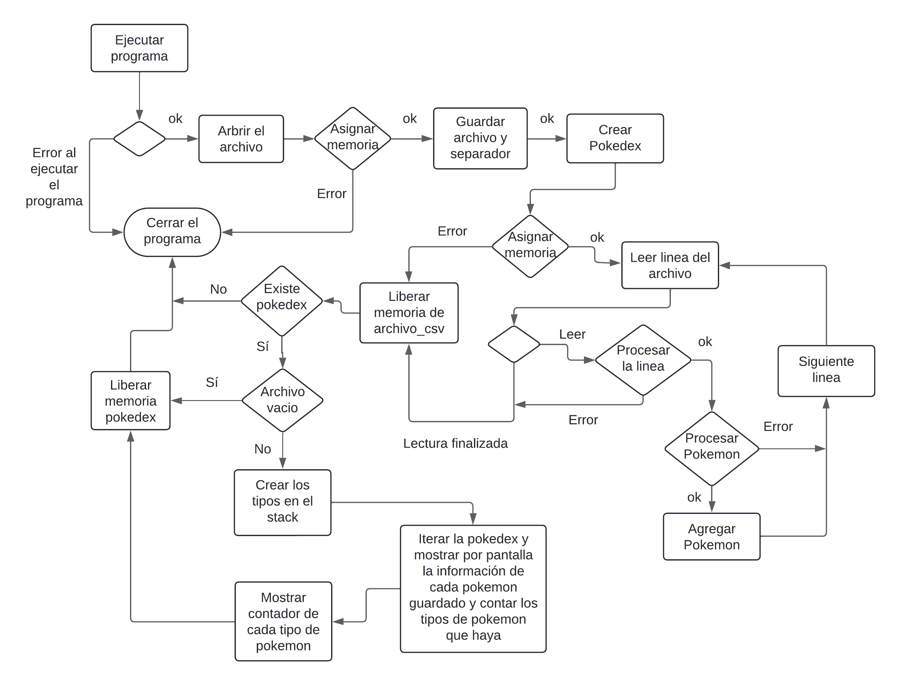

<div align="right">

</div>

# TP1

# MANEJOS DE ARCHIVOS Y ESTRUCTURAS

## Alumno: Juan Ernesto Juarez Lezama - 110418 - jjuarez@fi.uba.ar

- Para compilar:

```bash
gcc -g tp1.c src/csv.c src/pokedex.c src/split.c -o tp1
```

- Para ejecutar:

```bash
./tp1 ejemplos/pokedex.csv
```

- Para ejecutar con valgrind:
```bash
valgrind ./tp1 ejemplos/pokedex.csv
```

---

##  Funcionamiento

Para la implementación de este TP nos piden leer un archivo como argumento de un programa compilado.
Tendrémos 2 estructuras, para la lectura de archivo y para almacenar elemento, en este caso, pokemones.

Acá muestro un diagrama de como sería el flujo del TP para que haga lo que nos piden.

<div align="center">

</div>

## Estructuras

### Estructura para la lectura de archivo

Teniendo en cuenta que cada vez que hago uso de un `malloc()` significa que pido bloque(s) de memoria al heap de manera dinamica, lo cual es O(1), por lo que si pido, tengo que liberar luego con un `free()`, que tambien es O(1)`. 

## csv.c

### `abrir_archivo_csv` O(1)
Inicializa la estructura `struct archivo_csv` y devuelvo su dirección de memoria. Esta estructura inicializada, está ubicada en el heap, en un bloque de memoria de manera dinamica debido al uso de `malloc()`. 
Esta estructura guarda un puntero al tipo de dato FILE*, donde se encuentra nuestro archivo. En qué parte de la memoria se situa el archivo, va a varias del sistema operativo, pero apriori, diremos que en el heap.
Al ser inicializaciones de malloc, inicializar variables, podemos decir que esta funcion es `O(1)`.

```c
struct archivo_csv *archivo_tp1 = abrir_archivo_csv(argv[1], ';');
```
<div align="center">

</div>

---

### `leer_linea_csv` O(c) + O(m)
En primer lugar, dentro de la función, como no sabemos cuantos caracteres van a ser, y no queremos tener un limite de caracteres,vamos a crear una variable `char* texto` de forma dinamica con `malloc()`, donde almacenaremos la cadena de caracteres de cada linea del archivo. esta parte de la función es `O(c)`, siendo `c` la cantidad de caracteres en la linea de texto. De esta manera tenermos la linea de texto en una varible.

```c
	while ((valor_ascii = fgetc(archivo->archivo)) != EOF &&
	       valor_ascii != '\n') {
		if (tamaño_del_texto >= (capacidad_linea * 75) / 100) {
			if (!redimencionar_linea_texto(&texto,
						       &capacidad_linea)) {
				free(texto);
				return columna_posicion;
			}
		}
		texto[tamaño_del_texto++] = (char)valor_ascii;
	}
```

En la funcion de `dividir_partes`, sin entrar en tantos detalles, va a iterar la linea de texto que guardamos y separar palabra por palabra cuando haya una separador presente, lo cual, lo hace tambien `O(c)`;

```c
struct Partes *partes = dividir_string(texto, archivo->separador);
```

De ahí entramos en un ciclo while, la cual va a estar usando puntero a funciones y punteros a void, esta parte de la función. Al ser un ciclo que dependa de que sea menor que columna, y siendo columna una variable que puede ser cualquier valor, decimos que el ciclo while es `O(m)`, siendo `m` la cantidad de columnas que tiene cada texto (cada columna es definido por el separador). Si salimos del ciclo while por su condición, sabemos que iteró todas las columnas, por eso al final hay un `return columas`. Si en alguna función es NULL e iba en la tercera iteracion, decimos que itero solo 2 veces, pero si en la tercera iteracion dio falso, decimos que iteró 3 veces. Dentro del cilo, va a haber funciones, pero como está destinado al parseo de datos, decimos que adentro del ciclo es `O(1)`.

Entonces noes quedaria en total que la función queda como `O(c) + O(m)`;